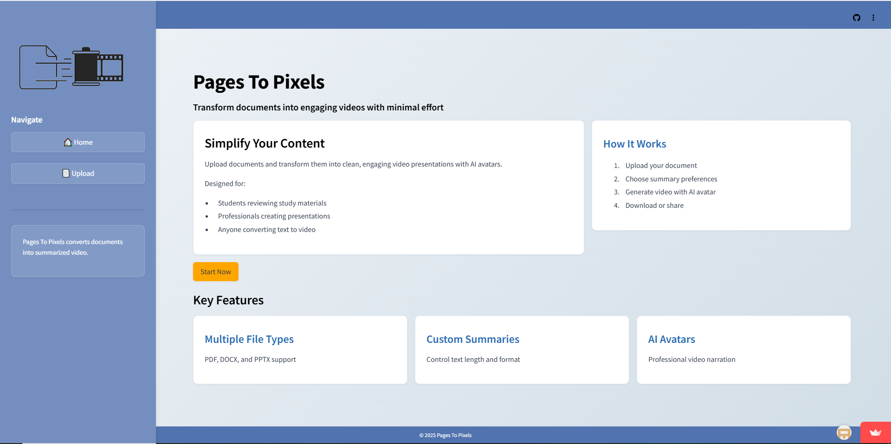
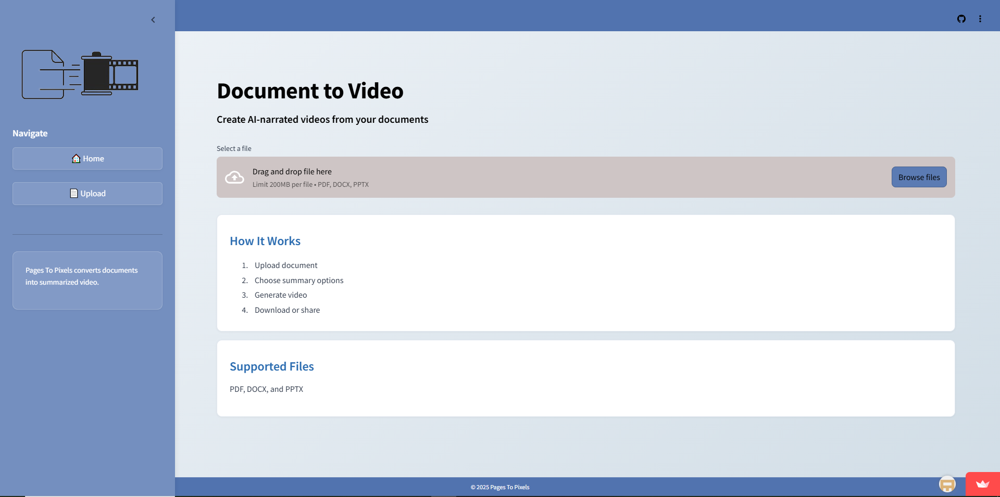
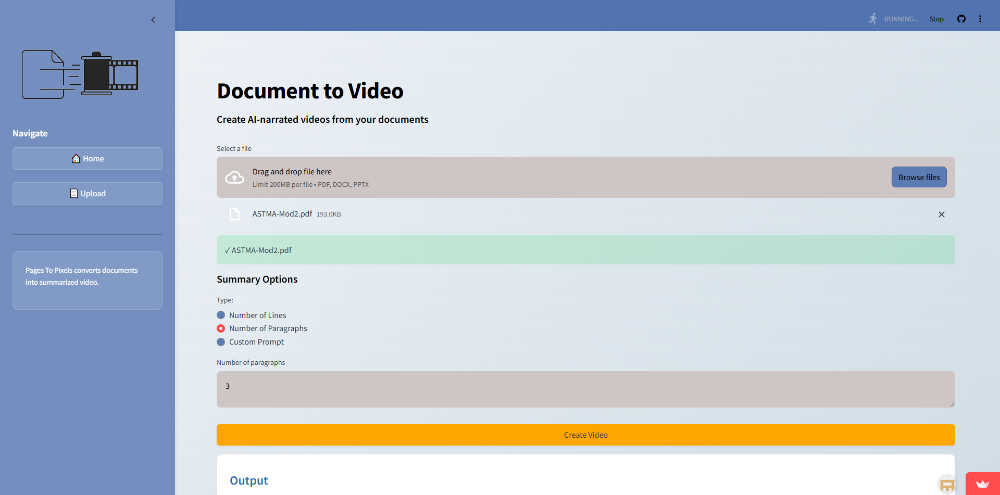
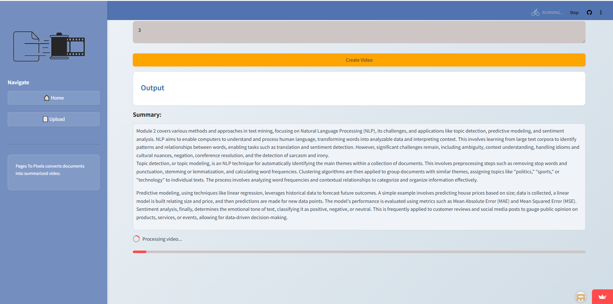

# PagesToPixel 🎥📄

An **AI-powered document-to-video generation application** built using **Python, Streamlit, Google Gemini API, and HeyGen API**. The app allows users to upload documents, generate customizable AI-powered summaries, and transform the summarized content into engaging **AI avatar-based videos**.

---

## Features

* **Multi-Format Document Upload** – Supports PDF, DOCX, and PPTX files
* **AI-Powered Summarization** – Uses Google Gemini to analyze uploaded documents and generate concise summaries
* **Customizable Summaries** – Allows users to control the summary style and level of detail
* **AI Avatar Video Generation** – Converts generated summaries into avatar-based videos using HeyGen
* **Interactive Streamlit UI** – Provides a simple and user-friendly interface for document processing
* **Multiple Summary Options** – Users can choose different summary configurations based on their requirements
* **Document Text Extraction** – Extracts content from uploaded documents for AI processing

---

## Tech Stack

* **Frontend / UI**: Streamlit
* **Backend / Logic**: Python
* **AI Model**: Google Gemini API
* **AI Video Generation**: HeyGen API
* **PDF Processing**: PyMuPDF
* **DOCX Processing**: python-docx
* **PPTX Processing**: python-pptx
* **API Communication**: Requests

---

## Running the App

### 1. Clone the Repository

```bash
git clone https://github.com/annette009/pagestopixels.git
cd PagesToPixel
```

### 2. Install Dependencies

```bash
pip install -r requirements.txt
```

### 3. Configure API Keys

Create a Streamlit secrets file:

```text
.streamlit/secrets.toml
```

Add your API credentials:

```toml
GEMINI_API_KEY = "your-gemini-api-key"
HEYGEN_API_KEY = "your-heygen-api-key"
```

**Never commit ****`secrets.toml`**** or expose API keys publicly.**

### 4. Run the Application

```bash
python3 -m streamlit run main.py

```

---

## How It Works

### 1. Upload a Document

Upload a **PDF, DOCX, or PPTX document** through the document upload interface.





### 2. Customize the Summary

The application extracts the document content and allows users to choose how they want the summary to be generated, including the **number of lines, number of paragraphs, or a custom prompt**.



### 3. Generate an AI Summary

The extracted content is processed using the **Google Gemini API**, which generates a concise summary based on the user's selected preferences.



### 4. Generate the AI Avatar Video

The generated summary is sent to the **HeyGen API**, which converts the content into an AI avatar-based video that can be viewed and downloaded.


---

## Example Use Cases

* Convert lengthy documents into concise video summaries
* Create educational videos from study materials
* Transform presentations into AI avatar explanations
* Generate video-based summaries of reports and documents
* Create engaging visual content from text-heavy material

---

## Security & Safety

* API credentials are managed using **Streamlit secrets**
* API keys should never be committed to the repository
* Temporary files and Python cache files are excluded from version control
* Uploaded documents are processed within the application workflow

---

## Acknowledgements

* **Google Gemini API** – AI-powered document summarization
* **HeyGen API** – AI avatar video generation
* **Streamlit** – Interactive application framework
* **PyMuPDF** – PDF text extraction
* **python-docx** – DOCX document processing
* **python-pptx** – PowerPoint document processing
* **Python open-source ecosystem**
